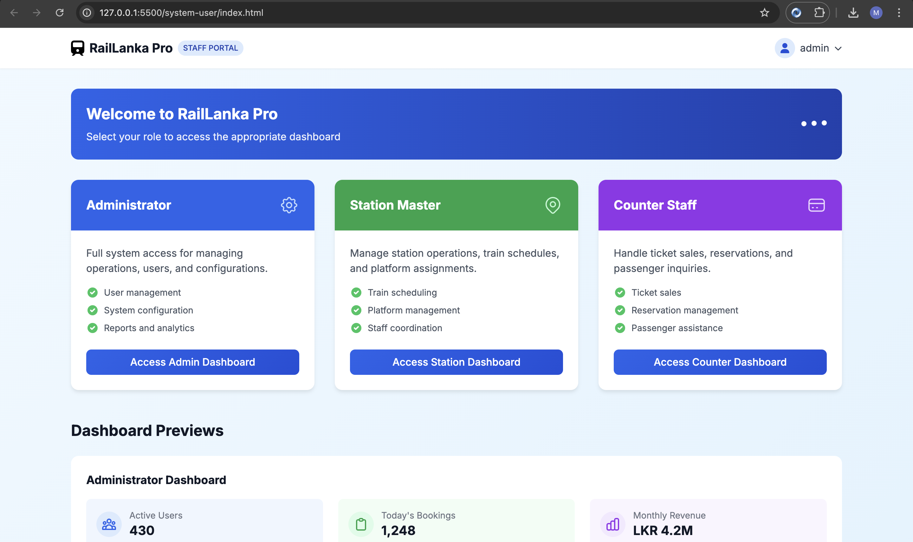
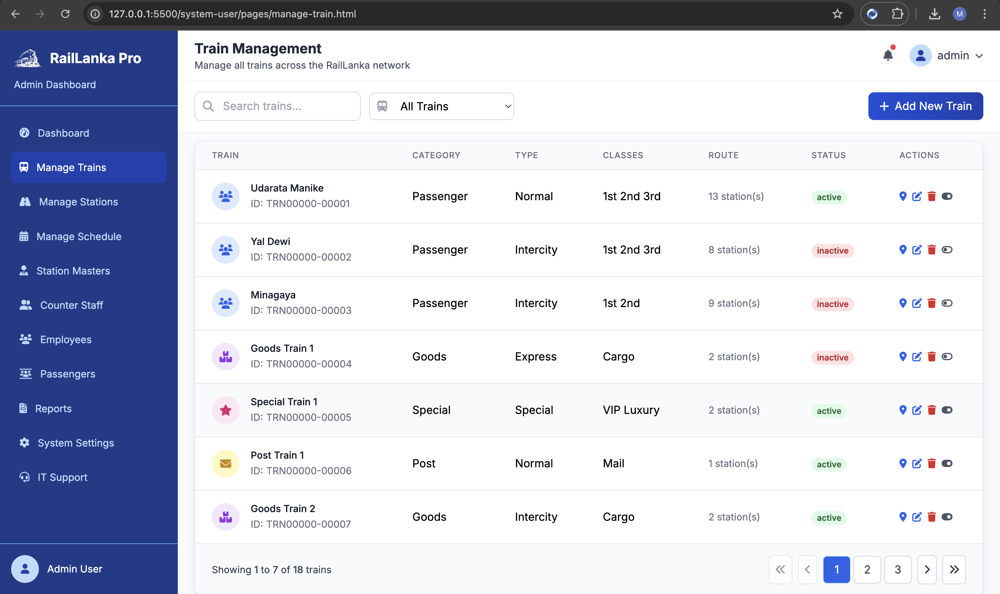
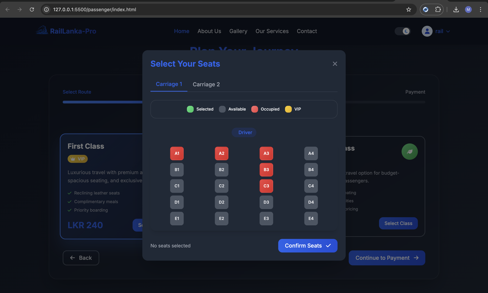

# 🚆 Rail Lanka Pro – Smart Railway Management System

Rail Lanka Pro is a **full-stack, enterprise-level railway management system** built to handle train operations, employee management, passenger bookings, and reporting — all in one place.  

It includes **two separate web applications**:

- 👨‍💻 **Staff/Admin Dashboard** – For staff & admin users  
- 🧳 **Passenger Website** – Public-facing portal for passengers  

Designed to improve efficiency, reduce manual errors, and deliver a **professional ticket booking experience**.

---

## 🎥 Demo Video

▶️ **[Watch on YouTube](https://youtu.be/fXlik_M5mSM)**  

---

## 📸 Screenshots

| Staff Dashboard | Passenger Website |
|-----------------|-----------------|
|  |  |
|  |  |
|  |  |

> 🖼️ *Recommended: Capture HD screenshots of key features and crop them for a clean look.*

---

## 🏁 Features Overview

### 🖥️ Staff / Admin Dashboard (Internal System)
The staff dashboard acts as the **central control room** for railway operations.

#### ✅ Train Management
- Add, update, delete, activate/deactivate trains
- Manage **4 Train Categories:** `Post`, `Passenger`, `Goods`, `Special`
- Manage **3 Train Types:** `Express`, `Intercity`, `Intermediate`
- Search & filter trains by **category, type, station, or status**
- Real-time activation/deactivation without restarting the system

#### ✅ Station Management
- Add new stations, update station details
- Mark stations as active/inactive
- View station list with quick search functionality

#### ✅ Schedule Management
- Create & update train schedules
- **Automatic Conflict Detection** – warns when two trains overlap on same route/time
- Visual calendar view (optional)

#### ✅ Employee Management
- Add/edit employee records
- Filter employees by station, designation
- Generate employee reports as PDF

#### ✅ Passenger Management
- View passenger profiles
- Activate / deactivate passengers for security reasons
- Monitor ticket booking history

#### ✅ Reporting
- Generate PDF reports for:
  - Train usage statistics
  - Station activity
  - Employee list
  - Revenue summary
- Download reports instantly from dashboard

#### ✅ IT Support & Notifications
- Staff can raise IT support tickets
- Internal messages & announcements

---

### 🌍 Passenger Website (Public)
The passenger site is **modern, mobile-first, and responsive**, making it easy for users to book tickets.

#### ✨ Passenger Features
- **Smart Train Search** – by departure & destination
- **Date, time, class filters** for better results
- **Seat Availability Check** before booking
- **Manual Seat Selection** for first-class passengers
- **Real-Time Pricing** updates
- **Mobile-Optimized** for booking on-the-go
- **Light & Dark Themes** for user preference

#### 🎟 Booking Logic
When a passenger books a ticket:
1. **Seat Locking:** Temporarily reserves the seat to avoid double-booking  
2. **Secure Payment:** Completes transaction via payment gateway  
3. **Ticket Handling:**
   - Saves booking in DB
   - Generates PDF ticket (using OpenPDF)
   - Sends ticket via email (Spring Mail + Thymeleaf template)
   - Makes it downloadable from user portal

---

## 🔐 Security & Authentication

- **Spring Security** with **JWT Authentication**
- **Access Token & Refresh Token** support
- Role-based authorization (`ADMIN`, `STAFF`, `PASSENGER`)
- Password encryption using **BCrypt**
- Session timeout & auto-refresh for better UX

---

## ⚙️ Tech Stack

| Layer | Technologies |
|------|--------------|
| **Backend** | Spring Boot, Spring Security, JWT, REST APIs |
| **Frontend** | HTML, CSS, JavaScript (Two separate projects) |
| **Database** | MySQL |
| **Template Engine** | Thymeleaf (for email templates) |
| **PDF Generation** | OpenPDF |
| **Build Tool** | Maven |
| **Deployment** | Apache Tomcat / Spring Boot Embedded |
| **Version Control** | Git + GitHub |

---

## 🔧 Installation & Setup

1. **Clone the Repository**
   ```bash
   [git clone https://github.com/your-username/rail-lanka-pro.git](https://github.com/ManuthLakdiw/RailLanka-Pro.git)
