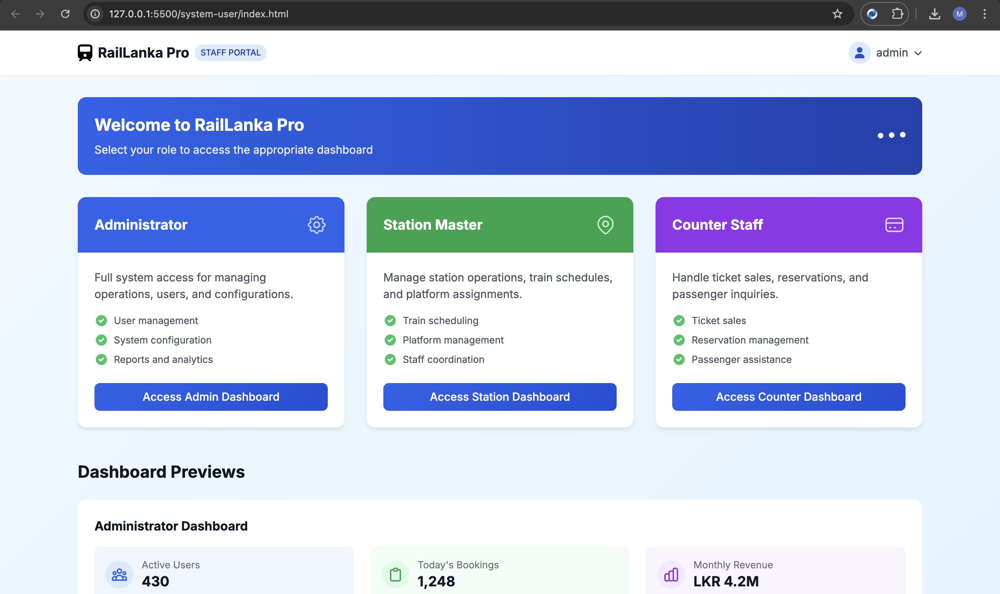
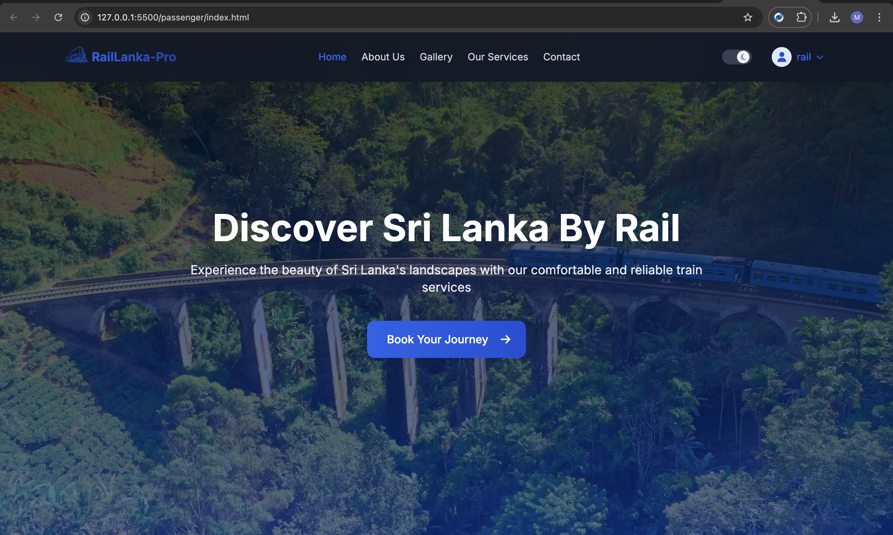
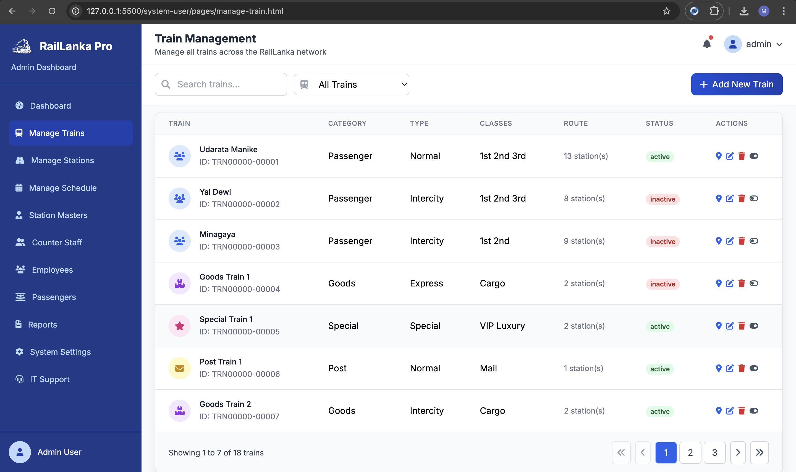
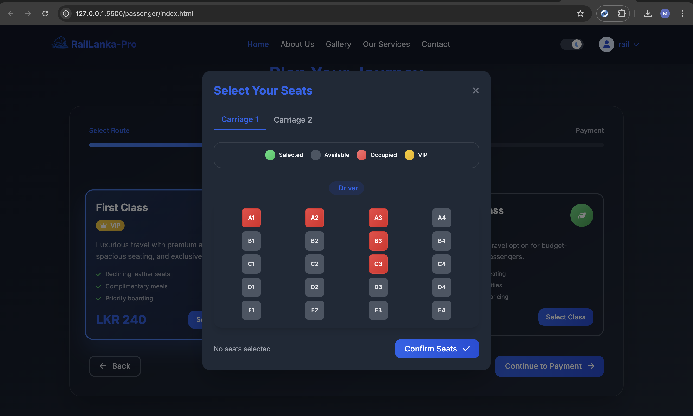

# 🚆 Rail Lanka Pro – Smart Railway Management System

Rail Lanka Pro is a **full-stack, enterprise-level railway management system** built to handle train operations, employee management, passenger bookings, and reporting — all in one place.  

It includes **two separate web applications**:

- 👨‍💻 **Staff/Admin Dashboard** – For staff & admin users  
- 🧳 **Passenger Website** – Public-facing portal for passengers  

Designed to improve efficiency, reduce manual errors, and deliver a **professional ticket booking experience**.

---

## 🎥 Demo Video

▶️ **[Watch on YouTube](https://youtu.be/l3oJTQOwWWo)**  
See how the system works step by step — from staff dashboard management to passenger ticket booking!


---

## 📸 Screenshots

| Staff Dashboard | Passenger Website |
|-----------------|-----------------||
|  |  |
|  |  |
|  |  |

> 🖼️ *Recommended: Capture HD screenshots of key features and crop them for a clean look.*

---

## 🗂️ Project Navigation

This is a monorepo containing both the frontend and backend codebases. Use the links below to navigate to detailed documentation for each part:

| Module | Description | Documentation |
|--------|-------------|---------------|
| 🎨 **Frontend** | Vanilla HTML/CSS/JS — Staff Dashboard & Passenger Portal | [Frontend README](./Fornt-End/README.md) |
| ⚙️ **Backend** | Spring Boot REST API with JWT, JPA, MySQL | [Backend README](./Back-End/README.md) |

---

## 🏗️ System Architecture Overview

```
RailLanka Pro/
├── Back-End/          ← Spring Boot REST API (Java 21, Maven)
├── Fornt-End/
│   ├── system-user/   ← Staff / Admin Dashboard (Vanilla JS)
│   └── passenger/     ← Passenger Booking Portal (Vanilla JS)
└── Screen-Shots/      ← Project screenshots & sample PDFs
```

The backend exposes a single REST API (`/api/v1/raillankapro/`) consumed by both frontend applications. Authentication is handled via **JWT Access + Refresh Tokens**, and all protected routes require a valid `Bearer` token.

---

## 🏁 Features Overview

### 🖥️ Staff / Admin Dashboard (Internal System)
The staff dashboard acts as the **central control room** for railway operations.

#### ✅ Train Management
- Add, update, delete, activate/deactivate trains
- Manage **4 Train Categories:** `Post`, `Passenger`, `Goods`, `Special`
- Manage **3 Train Types:** `Express`, `Intercity`, `Intermediate`
- Search & filter trains by **category, type, station, or status**
- Real-time activation/deactivation without restarting the system

#### ✅ Station Management
- Add new stations, update station details
- Mark stations as active/inactive
- View station list with quick search functionality

#### ✅ Schedule Management
- Create & update train schedules
- **Automatic Conflict Detection** – warns when two trains overlap on same route/time
- Visual calendar view (optional)

#### ✅ Employee Management
- Add/edit employee records
- Filter employees by station, designation
- Generate employee reports as PDF

#### ✅ Passenger Management
- View passenger profiles
- Activate / deactivate passengers for security reasons
- Monitor ticket booking history

#### ✅ Reporting
- Generate PDF reports for:
  - Train usage statistics
  - Station activity
  - Employee list
  - Revenue summary
- Download reports instantly from dashboard

#### ✅ IT Support & Notifications
- Staff can raise IT support tickets
- Internal messages & announcements

---

### 🌍 Passenger Website (Public)
The passenger site is **modern, mobile-first, and responsive**, making it easy for users to book tickets.

#### ✨ Passenger Features
- **Smart Train Search** – by departure & destination
- **Date, time, class filters** for better results
- **Seat Availability Check** before booking
- **Manual Seat Selection** for first-class passengers
- **Real-Time Pricing** updates
- **Mobile-Optimized** for booking on-the-go
- **Light & Dark Themes** for user preference

#### 🎟 Booking Logic
When a passenger books a ticket:
1. **Seat Locking:** Temporarily reserves the seat to avoid double-booking  
2. **Secure Payment:** Completes transaction via payment gateway  
3. **Ticket Handling:**
   - Saves booking in DB
   - Generates PDF ticket (using OpenPDF)
   - Sends ticket via email (Spring Mail + Thymeleaf template)
   - Makes it downloadable from user portal

---

## 🔐 Security & Authentication

- **Spring Security** with **JWT Authentication**
- **Access Token & Refresh Token** support
- Role-based authorization (`ADMIN`, `STAFF`, `PASSENGER`)
- Password encryption using **BCrypt**
- Session timeout & auto-refresh for better UX

---

## ⚙️ Tech Stack

| Layer | Technologies |
|------|--------------||
| **Backend** | Spring Boot 3.5.4, Spring Security, JWT (JJWT 0.11.5), REST APIs |
| **Frontend** | Vanilla HTML5, CSS3, JavaScript (ES6+) |
| **Database** | MySQL 8+ |
| **ORM** | Spring Data JPA / Hibernate |
| **Template Engine** | Thymeleaf (for email templates) |
| **PDF Generation** | OpenPDF 1.3.30 |
| **QR Code** | ZXing 3.5.3 |
| **SMS** | Notify.lk API |
| **Payment** | PayHere Payment Gateway |
| **Build Tool** | Apache Maven |
| **Runtime** | Java 21, Spring Boot Embedded Tomcat |
| **Version Control** | Git + GitHub |

---

## 🔧 Quick Start

### Prerequisites
- Java 21+
- Maven 3.8+
- MySQL 8+
- A modern web browser (Chrome, Firefox, Edge)

### 1. Clone the Repository
```bash
git clone https://github.com/ManuthLakdiw/RailLanka-Pro.git
cd RailLanka-Pro
```

### 2. Setup & Run Backend
See the full guide → **[Backend README](./Back-End/README.md)**

### 3. Open the Frontend
See the full guide → **[Frontend README](./Fornt-End/README.md)**

---

## 👨‍💻 Author

**Manuth Lakdiw**  
- 🐙 GitHub: [@ManuthLakdiw](https://github.com/ManuthLakdiw)  
- 📧 Email: manuthlakdiv2006.com

---

## 📄 License

This project is developed for educational purposes at **IJSE (Institute of Java & Software Engineering)**.

---

> ⭐ If you found this project helpful, please consider giving it a **star** on GitHub!
